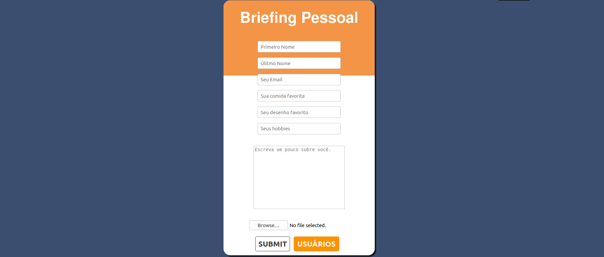

# Briefing Pessoal

Foi um projeto iniciado com a intenção de testar minhas capacidades numa aplicação fullstack, tendo a parte front-end desenvolvida com as tecnológias, HTML, SCSS e JS, o back-end foi desenvolvido com nodejs e alguns outros modulos.

## Descrição detalhada do projeto

Essa é a primeira vez que junto conhecimentos adquiridos em front e back, devo dizer que estou bem contente com o resultado, aprendi diversas coisas durante a jornada, como por exemplo utilizar o mongoose e seus schemas, também serviu para fixar conhecimentos, as minhas rotas express que o diga.

## Planejamento até a conclusão

### Fase: Ideia Init

* Realizar um brainstorm de projetos que poderiam me desafiar sem serem impossíveis
* Filtrar as más ideias

### Fase: Papel e Lápis

* Escrever no papel as funcionalidades que quero
* Começar um layout com as funcionalidades

### Fase: Duas Telas

* Abrir qualquer software que suporte edição de imagem
* Começar a montar o wireframe, que fiz no papel, no software
* Feita as devidas micro alterações e melhorias, fazer uma versão high fidelity, mas não perder muito tempo

### Fase: VSCode NodeJS

* Importar tudo o que sei que vou precisar
* Montar todas as rotas de acordo com as funcionalidades desejadas
* Testar tudo utilizando algum api testing tool
* Decidir um banco de dados
* Estabelecer as devidas conexões e testar novamente

### Fase: Voltamos a Estética

* Levantar um html básico
* Inserir todas as funcionalidades desejadas, referentes ao html
* Começar o css(scss)

### Fase: DOM

* Começar o js
* Analisar as funcionalidades desejadas e planejar as funções necessárias
* Desenvolver rotas
* Construir funções
* Testar tudo
* Refatorar funções

### Fase: Final

* Subir a api na sua plataforma de preferência
* Testar novamente
* Subir o front na sua plataforma de preferência
* Testar novamente
* Escrever 61 linhas no github

**Pronto, missão completa.**
